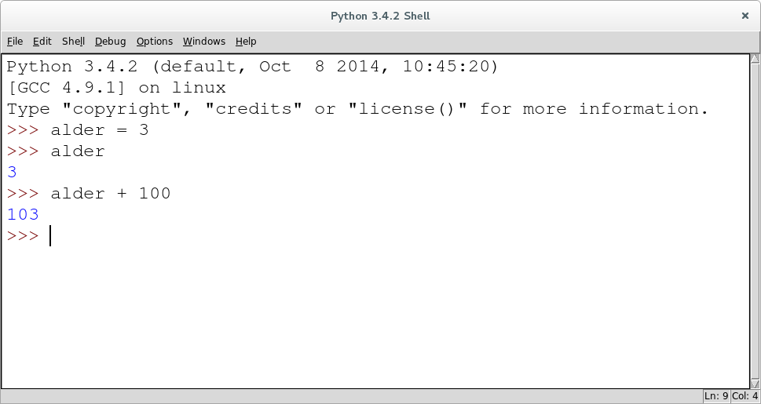
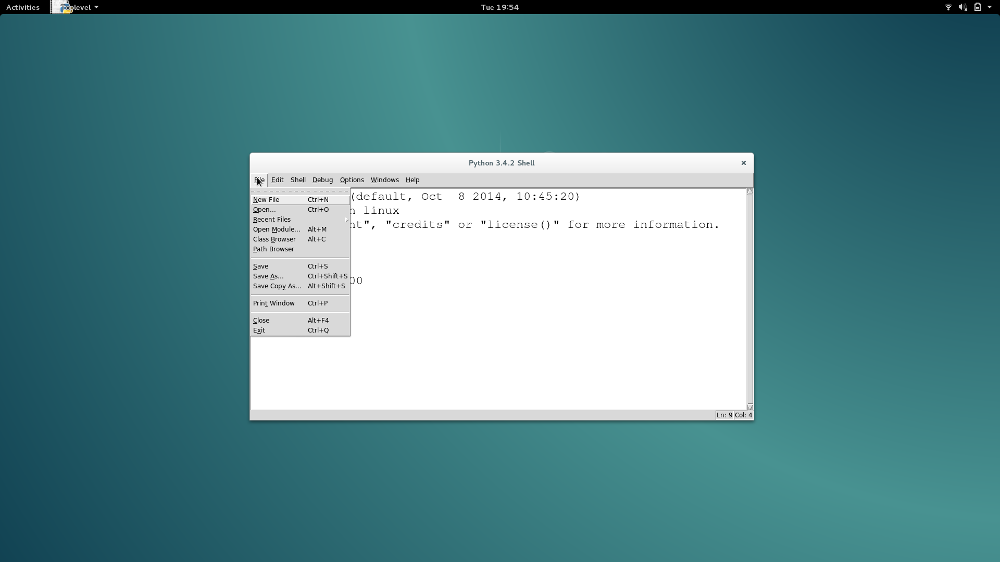
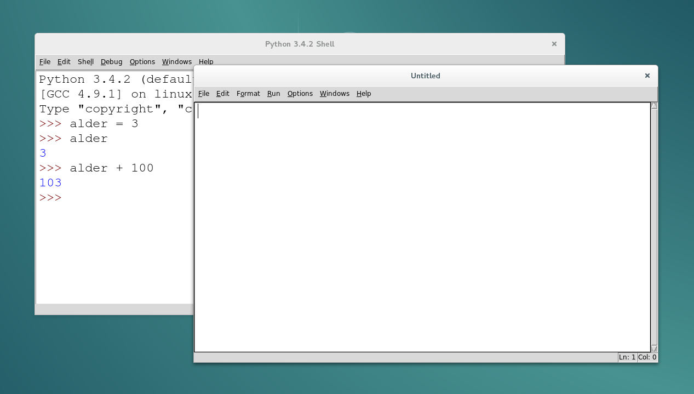
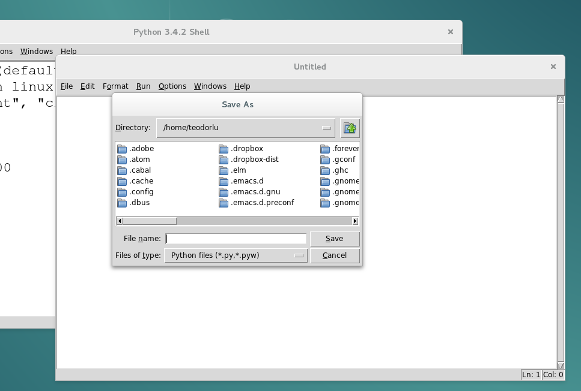
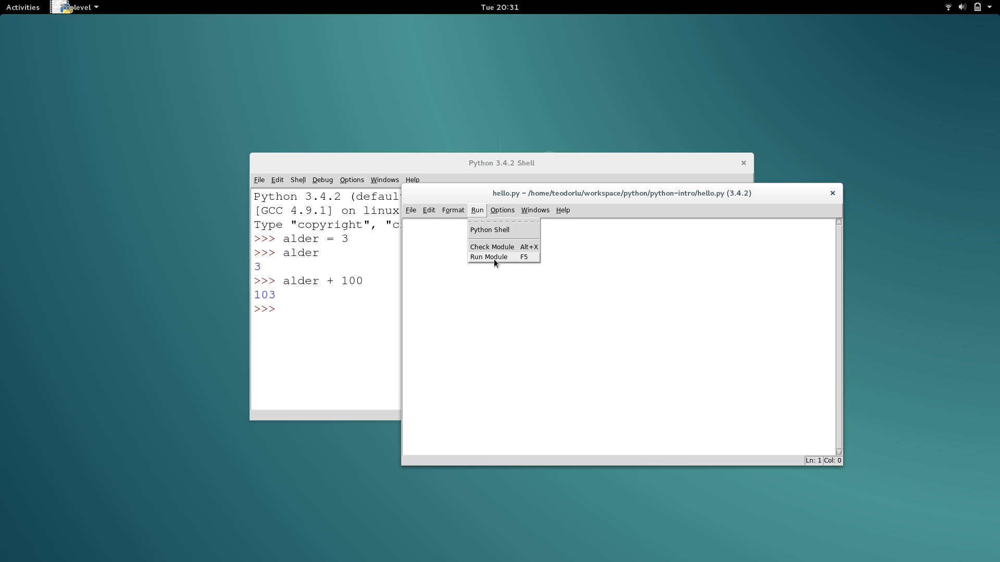
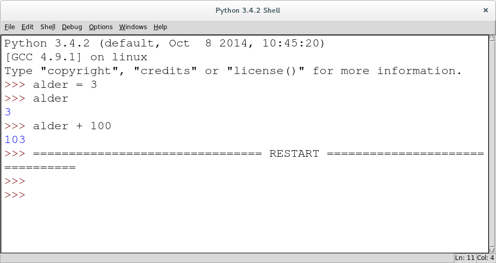
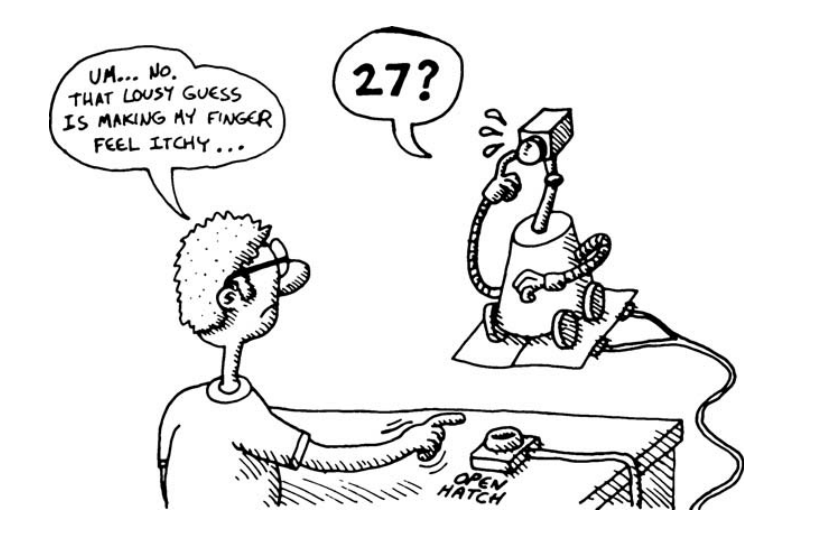
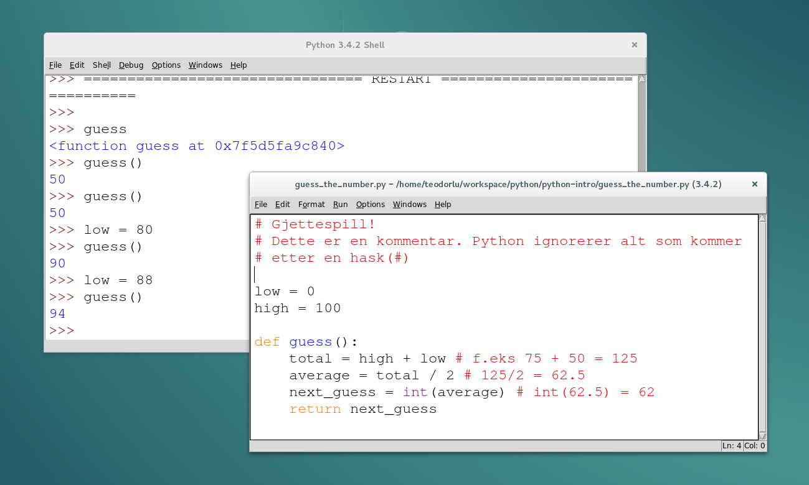

# Programmering i Python

### Lærerkonferanse Oslo 2016

## Hva ser jeg nå?

Nettleseren Chromium som viser nettsiden `http://teodorlu.github.io/python-intro/` i fullskjerm.

Gå inn her på egen maskin! Da kan du se tidligere lysbilder, og er ikke avhengig av hvor vi er.

## Hvem er vi?

Teodor Heggelund


---

Alexander Perry


# Hvorfor Python?

## For begynnere

Forståelig syntaks med lite støy:

```python
>>> navn = "Teodor"
>>> navn
'Teodor'
>>> "Hei! Jeg heter " + navn
'Hei! Jeg heter Teodor'
```

## *og* viderekommende

* Støtter imperativ, objektorientert og funksjonell programmering
* Knallgodt standardbibliotek

## Driver New York Times


## Brukes av NASA


## Brukes av Google


## Driver beregninger

Troll II, 1995


# Verktøy

## Hva trenger vi?

Når vi utvikler Python, trenger vi to verktøy:

* Et skall
* En teksteditor

Når vi installerer programmeringsspråket Python, følger miljøet IDLE med.
IDLE gir oss et skall og en teksteditor.

## Last ned Python

1. Gå til [python.org/downloads](https://www.python.org/downloads/)
2. Last ned og installer nyeste Python (`3.x.x`)

## Python-skallet i IDLE

Et skall lar oss skrive en linje og tolke den.



## Python-skallet i IDLE

Tre piler (`>>>`) dukker automatisk opp i skallet. Når vi skriver tre piler her:

```
>>> 4 + 4
8
```

skal du skrive `4 + 4` og trykke enter.

## Teksteditoren i IDLE



## Teksteditoren i IDLE

Vi åpner teksteditoren ved å lage en ny fil fra Python-skallet:

`File` --> `New file` (`Ctrl+N`) gir oss en tom fil:



## Teksteditoren i IDLE

Først lagrer vi filen der vi vil ha den, og kaller den `hello.py` ...



## Teksteditoren i IDLE

... så kjører vi den for å se at alt er i orden ...



## Teksteditoren i IDLE

... og en tom fil gjør ... ingenting.



# Variabler

## Hva er en variabel?

* Tilordner verdier til navn, for gjenbruk

## Variabler i Python

```python
>>> navn = "Alexander Perry"
>>> navn
'Alexander Perry'
>>> alder = 27
>>> alder
27
```

## Oppgave: familiens alder

* Lagre alderen til 3 familiemedlemmer i variabler

```python
>>> tim_age = 18
# ... og så videre
# Dette er en kommentar. Python ignorerer alt som kommer etter
# en hash (#)
```

* Lagre summen av alderene i en variabel
* Lagre gjenomsnittet av alderene i en variabel

## Tekstmanipulering

```python
>>> navn1 = "Alexander"
>>> navn2 = "Teodor"
>>> navn1 + navn2
```

## Tekstmanipulering

```python
>>> navn1 = "Alexander"
>>> navn2 = "Teodor"
>>> navn1 + navn2
'AlexanderTeodor'
```

## Tekstmanipulering

```python
>>> navn1 = "Alexander"
>>> navn2 = "Teodor"
>>> navn1 + " " + navn2
'Alexander Teodor'
```


# Stemningen i Python

## Navnet?


---


Fra [XKCD](http://xkcd.com/353/).

# If

## Hva er if-setninger?

* Sjekker om et uttrykk er sant, og kjører så en gitt kodesnutt

## If-setninger i Python
```python
>>> alder = 20
>>> if alder == 20:
>>>     svar = "Du er 20 år gammel"
>>> svar
'Du er 20 år gammel'
```

## If-setninger i Python
```python
>>> alder = 30
>>> if alder > 20:
>>>     svar = "Du er over 20 år gammel"
>>> svar
'Du er over 20 år gammel'
```

## If-setninger i Python
```python
>>> alder = 10
>>> if alder < 20:
>>>     svar = "Du er under 20 år gammel"
>>> svar
'Du er under 20 år gammel'
```

## If-setninger i Python
```python
>>> alder = 30
>>> if alder == 20:
     svar = "Du er 20 år gammel"
else:
     svar = "Du er ikke 20 år gammel"
>>> svar
'Du er ikke 20 år gammel'
```

## Oppgave: Gammel nok?

Lag et program som

* Lagrer en alder i en variabel
* Skriver ut "Du er ikke gammel nok" dersom alderen er under 18 år

# Programmer ditt eget gjettespill!

## Hø?



## Attributter

Spill og illustrasjon er hentet fra den strålende boka "Land of Lisp" av Conrad Barski, og tilpasset Python.

Musikkvideo:

<iframe width="560" height="315" src="https://www.youtube.com/embed/HM1Zb3xmvMc" frameborder="0" allowfullscreen></iframe>

## Demo

Slik kan det fungere ...

Sider under beskriver hvordan gjettespillet kan implementeres. Prøv først selv,
og gå videre nedover om du trenger et tips!

## Gjettefunksjon

Gitt at vi har en øvre og nedre grense, kan vi gjette at tallet ligger midt i mellom:

<!--  -->

```python
# Gjettespill!

low = 0
high = 100

def guess():
    total = high + low          # f.eks 75 + 50 = 125
    average = total / 2         # 125/2 = 62.5
    next_guess = int(average)   # int(62.5) = 62
    return next_guess
```

## Prøve gjettefunksjon

Hvordan fungerer denne? Vi kjører modulen i IDLE, så vi kan leke med verdiene.

```python
>>> guess
<function guess at 0x7fee85ff9840>
```

Wops, guess var en funksjon. Vi trenger paranterser for å *kalle* en funksjon:

```python
>>> guess()
50
```

## Prøve gjettefunksjon

```python
>>> high
100
>>> low
0
```

... så low starter på 0, og high på 100. Hva om vi endrer på dette?

```python
>>> low = 75
>>> guess()
87
```

## Lavere? Høyere?

```python
>>> # Hemmelig tall er 42!
>>> guess()
50
>>> lower()
24
>>> higher()
37
>>> higher()
43
>>> lower()
40
>>> higher()
41
>>> higher()
42
```

## Lavere? Høyere?

Vi svarer datamaskinen ved å kalle funksjonen `lower()` eller `higher()`:

```python
def lower():
    # global lar oss endre en global variabel
    # inne i en funksjon
    global high
    high = guess() - 1
    return guess()

def bigger():
    global low
    low = guess() + 1
    return guess()
```

## Hva når vi vinner?

```python
>>> # Guessing 77
>>> guess()
50
>>> higher()
75
>>> higher()
88
>>> lower()
81
>>> lower()
78
>>> lower()
76
>>> higher()
77
>>> correct()
'Yippie!!!'
```

## "Binærsøk"

Gratulerer, dere har nå implementert et binærsøk!

# Lister

## Hva er lister?

* Null-indeksert liste over verdier

## Lister i Python
```python
>>> masseTall = [1,2,3,4,5,6,7,8,9]
>>> masseTall[0]
1
```

## Oppgave: elementer fra liste

* Lag en liste som inneholder 5 tall
* Skriv ut første tall
* Skriv ut nest siste tall

Tips: `list[-3]` henter element 3 *bakfra*!

# While

## Hva er while-løkker?

* Kjører en kodesnutt så lenge et gitt uttrykk er sant
* Kan kjøre evig, og avbrytes med break

## While-løkker i Python

```python
print("Dette er en huskeliste-app")
huskeliste = []

while True:
    svar = input("Legg til noe på huskelisten: ")
    huskeliste.append(svar)
    print(huskeliste)
```

## Oppgave: mattespill!

Lag et multiplikasjonsspill!

1. Be brukeren gange to tall
2. Sjekk svaret!
3. Gjør dette mange ganger ... `while`?

Tilfeldige tall:

```python
from random import randint

x = randint(0, 6) # gir x = 0, x = 1, ..., eller x = 5
```

# For

## Hva er for-løkker?

* Kjører en kodesnutt et gitt antall ganger
* Går igjennom (itererer) over en liste med verdier

## For-løkker i Python

```python
for i in range(100):
    print(i)
```

* `range(4)` gir `[0, 1, 2, 3]`
* `range(10)` gir `[0, 1, 2, 3, 4, 5, 6, 7, 8, 9]`
* `range(n)` gir *n* elementer!

## Flere for-løkker i Python

```python
mangeTall = [1,2,3,4,5,6,7,8,9]
for tall in mangeTall
    print("Sjekker om " + str(tall) + " er et partall")

    if tall % 2:
        print(str(tall) + " er et oddetall")
    else:
        print(str(tall) + " er et partall")
```

## Oppgave: mattespill 2!

* Bruk mattespillet du allerede har laget
* I stedet for *uendelig* mange oppgaver, gi brukeren 5 oppgaver!

# Veien videre

## Lykke til!

Dere gjør en viktig oppgave!

## Videre ressursser

* Disse sidene ligger på `http://teodorlu.github.io/python-intro/`, og blir her.
* [Kodeklubbens nettsider](http://kodeklubben.github.io/python/) har mange gode oppgaer på norsk. To spennende spill:
    * [Mattespill](http://kodeklubben.github.io/python/mattespill/mattespill.html)
    * [Gjettelek](http://kodeklubben.github.io/python/gjettelek/gjettelek.html)
* [Learn Python the Hard Way](https://learnpythonthehardway.org/book/) er dybtgående, grundig og lærerik.
